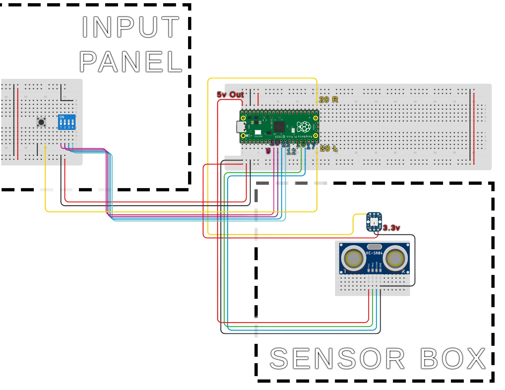
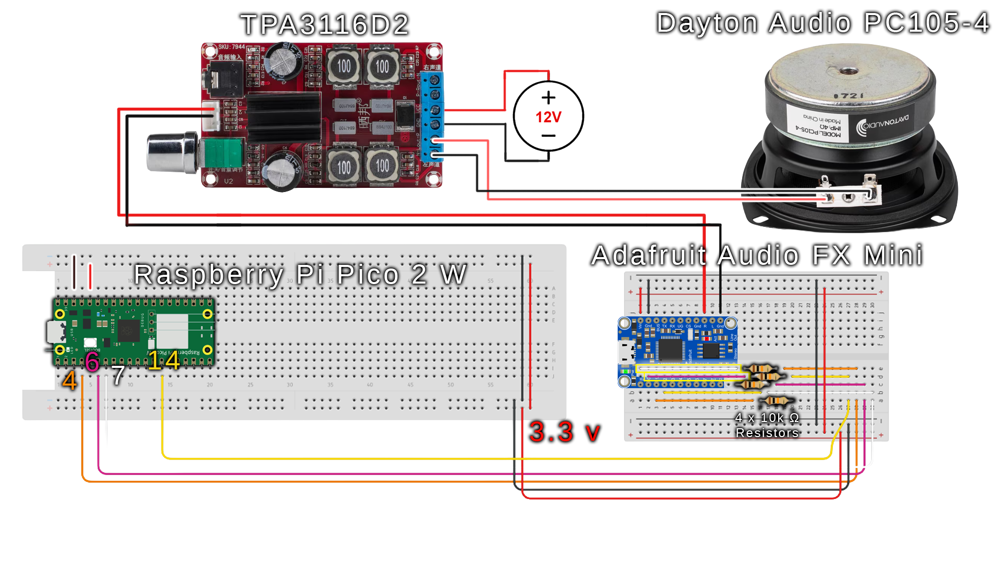
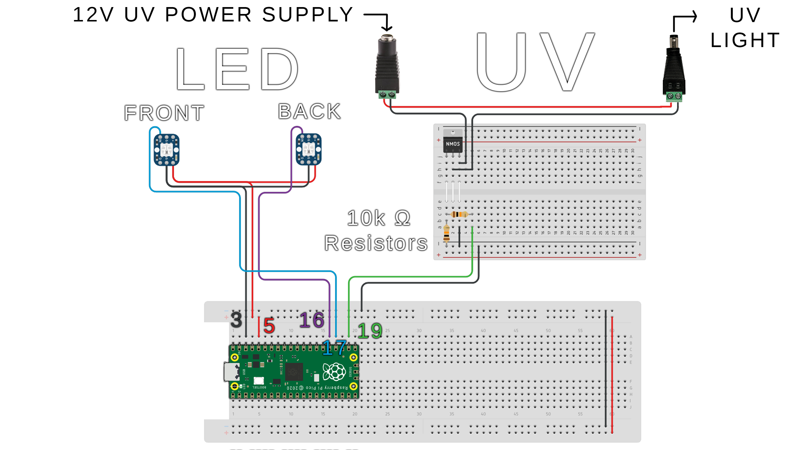

# MagicMillipod — Staff Operations & Maintenance Guide
**Prepared for:** Mr. Price / Museum Staff
**Product:** MagicMillipod Interactive Exhibit Controller

---

## Table of Contents
1. [System Overview](#1-system-overview)
2. [Normal Operations](#2-normal-operations)
3. [Safety Warnings](#3-safety-warnings)
4. [Routine Maintenance](#4-routine-maintenance)
5. [Troubleshooting & FAQ](#5-troubleshooting--faq)
6. [Replacement Parts List](#6-replacement-parts-list)

---

## 1. System Overview

The MagicMillipod is an automated interactive exhibit controller. It uses a distance sensor to detect when a visitor enters the exhibit room, then automatically plays a guided audio presentation paired with synchronized lighting effects, including UV (ultraviolet) light. Once the presentation finishes and the visitor exits, the system resets itself and becomes ready for the next visitor.

The system requires no interaction from staff during normal operation. Staff involvement is only needed for initial setup, periodic maintenance, and troubleshooting.

### 1.1 Components

| Component | Description |
|---|---|
| Control Box | Houses the main circuit board (Raspberry Pi Pico) and all electronics |
| Distance Sensor | Detects when a visitor enters the exhibit space |
| UV Light | Ultraviolet light activated during the presentation |
| LED Rings (×3) | Colored light rings that change color to indicate system state |
| Sound Board | Plays the pre-loaded audio tracks for the presentation |
| Speaker(s) | Outputs audio to the room |
| Reset / Calibration Button | Used by staff for setup and reset (located on the control box) |
| DIP Switches (×4) | Four small switches on the control box for configuration (see Section 2.3) |

### 1.2 Wiring Guide

The following sections describe how each component connects to the control box. Refer to the diagrams included with each section.

---

#### Part A — Power

The control box is powered by a single 5V DC power supply connected to the **VSYS** pin on the microcontroller. The amplifier board requires a separate higher-voltage supply (12V–24V DC) connected directly to its power input terminals. **Do not swap the two power supplies.** Connecting the wrong voltage to either board will cause permanent damage.

---

#### Part B — Distance Sensor

The HC-SR04 ultrasonic distance sensor has four pins:

| Sensor Pin | Connects To |
|---|---|
| VCC | 5V power |
| GND | Ground |
| TRIG | Control box — GP12 |
| ECHO | Control box — GP13 |

Mount the sensor so its face points toward the exhibit entrance at approximately chest height. Ensure no permanent objects are within the sensor's direct line of sight.

---

#### Part C — Audio Chain

Audio flows through three components in sequence: **Sound Board → Amplifier → Speaker.**

**Sound Board to Control Box:**

| Sound Board Pin | Connects To |
|---|---|
| GND | Ground |
| Trigger 0 | Control box — GP4 |
| Trigger 1 | Control box — GP2 |
| Reset | Control box — GP5 |
| Audio Out L/R | Amplifier input L/R |

**Amplifier to Speaker:**

| Amplifier Terminal | Connects To |
|---|---|
| VCC / GND | 12–24V DC power supply |
| Input L / Input R | Sound board audio output |
| Speaker Out + / − | Speaker terminals + / − |

---

#### Part D — LED Rings

Three NeoPixel LED rings are connected in a chain. Each ring has three wires: power (5V), ground, and data.

| Ring | Data Pin on Control Box |
|---|---|
| Ring 1 | GP18 |
| Ring 2 | GP19 |
| Ring 3 | GP16 |

All rings share the same 5V and GND lines. The data line for each ring connects directly to the control box — they are **not** daisy-chained to each other.

---

#### Part E — UV Light

The UV light is controlled through a MOSFET (a transistor that acts as an electronic switch). The control box sends a signal to the MOSFET, which switches the UV light on and off.

| Connection | Connects To |
|---|---|
| MOSFET Gate | Control box — GP17 |
| MOSFET Drain | UV light negative terminal |
| UV light positive | External power supply positive |
| MOSFET Source / GND | Shared ground |

> ⚠️ **Power off the system before handling UV light wiring.**

---

#### Part F — Buttons and DIP Switches

| Component | Control Box Pin |
|---|---|
| Reset / Calibration Button | GP15 → GND |
| DIP Switch 0 | GP6 → GND |
| DIP Switch 1 | GP7 → GND |
| DIP Switch 2 | GP8 → GND |
| DIP Switch 3 | GP9 → GND |

Each button and switch connects between its listed GPIO pin and any ground pin. No additional resistors are needed — the control board handles this internally.

### 1.3 System States

The system moves through the following states automatically. The LED ring color indicates which state is active:

| State | LED Color | Description |
|---|---|---|
| **Idle** | Blue | Waiting for a visitor. System is ready. |
| **Introduction** | Red + Rainbow | Visitor detected. Introduction audio playing. |
| **Presentation** | Red | Main presentation audio and UV light active. |
| **Exit Room** | Green | Presentation complete. Waiting for visitor to leave. |
| **Calibration** | Yellow | Staff calibration in progress (see Section 2.2). |

---

## 2. Normal Operations

### 2.1 Starting the System

1. Ensure all cables are securely connected as shown in the connection diagram (Section 1.2).
2. Plug the control box power cable into a standard wall outlet.
3. Wait approximately **5 seconds** for the system to finish starting up.
4. Confirm the LED rings glow **blue**. This indicates the system is in Idle state and ready for visitors.
5. The system will now operate automatically. No further action is required.

### 2.2 Calibrating the Distance Sensor (Required Before First Use and After Moving Equipment)

Calibration teaches the system what the room looks like when it is **empty** — specifically, how far away the far wall or door is. This allows the sensor to reliably detect when a visitor is present.

> **When to calibrate:** Before first use, after the exhibit is moved or rearranged, or any time the sensor appears to trigger incorrectly.

**Steps:**
1. Ensure the exhibit space is **completely empty** — no visitors, staff, or objects between the sensor and the far wall.
2. Locate the **Reset / Calibration Button** on the control box.
3. Press the button **briefly** (less than 1 second) and release it.
4. The LED rings will turn **yellow**, indicating calibration is in progress.
5. **Do not move anything** in the exhibit space for the next **10 seconds**.
6. After 10 seconds, the LED rings will return to **blue** (Idle). Calibration is complete.
7. Test by walking into the exhibit space — the presentation should begin automatically.

### 2.3 DIP Switches

The control box has four small numbered switches (1–4) that enable or disable specific features. Your engineering team will configure these prior to delivery. **Do not change DIP switch positions unless instructed to do so.**

### 2.4 Resetting the System

If the system becomes unresponsive or needs to return to Idle immediately:

1. Locate the **Reset / Calibration Button** on the control box.
2. Press and **hold** the button for at least **1 second**, then release.
3. The system will immediately return to Idle state (blue LEDs).

> **Note:** Resetting does not erase the calibration. You do not need to re-calibrate after a reset.

### 2.5 Powering Down

1. Allow the current presentation cycle to finish (LEDs return to blue), or perform a reset (Section 2.4).
2. Unplug the power cable from the wall outlet.

---

## 3. Safety Warnings

---

> ### ⚠️ WARNING — ULTRAVIOLET (UV) LIGHT EXPOSURE
>
> This system uses UV light during the presentation. **Direct exposure to UV light can cause eye irritation and skin damage**, similar to sunburn, even during brief exposure.
>
> - **Do not look directly at the UV light** while it is active.
> - Staff performing maintenance must **power the system off** before accessing the UV light or its housing.
> - Visitors with known UV light sensitivities should be advised before entering.
> - The UV light is only active during the **Presentation** state (red LEDs). It is fully off during all other states.

---

> ### ⚠️ WARNING — ELECTRICAL SAFETY
>
> - **Do not open the control box** unless the power cable has been unplugged from the wall.
> - **Do not expose the control box or any electronics to water or moisture.** The electronics are not waterproof.
> - If you observe burning smells, visible sparring, or smoke, **immediately unplug the system** and do not attempt to restart it. Contact your engineering team.
> - All power connections should use the cables provided. Do not substitute cables with different ratings.

---

> ### ⚠️ CAUTION — TRIP HAZARD
>
> Cables connecting the control box to remote components (sensor, lights, speakers) run along the floor or exhibit space. Ensure all cables are secured and covered to prevent tripping.

---

## 4. Routine Maintenance

Performing the following tasks on schedule will maximize the lifespan of the exhibit.

### 4.1 Maintenance Schedule

| Frequency | Task |
|---|---|
| Daily | Visual inspection of cables and LEDs |
| Weekly | Clean sensor lens; test full presentation cycle |
| Monthly | Inspect all cable connections; clean UV light housing |
| As needed | Re-calibrate after any repositioning of equipment |

---

### 4.2 Daily — Visual Inspection

**Tools needed:** None

**Steps:**
1. Power on the system and confirm the LED rings glow blue.
2. Visually inspect all visible cables for fraying, kinking, or disconnection.
3. Confirm the distance sensor is aimed at the exhibit entrance and has not been bumped or rotated.

**Success criteria:** Blue LEDs on, no visible cable damage, sensor pointing correctly.

---

### 4.3 Weekly — Sensor Lens Cleaning & Cycle Test

**Tools needed:** Soft dry cloth or lens wipe (no liquids)

**Steps:**
1. Power off the system.
2. Gently wipe the front face of the distance sensor (the two silver cylinders) with a dry cloth to remove dust.
3. Power the system back on and confirm blue LEDs.
4. Walk into the exhibit space and verify the presentation begins (LEDs change from blue to red).
5. Allow the presentation to complete, or reset the system (Section 2.4).

**Success criteria:** Sensor lens is clean; presentation triggers when a person enters the space.

---

### 4.4 Monthly — Connection Inspection & UV Housing Cleaning

**Tools needed:** Soft dry cloth; Phillips-head screwdriver (if applicable)

**Steps:**
1. Power off and unplug the system.
2. Without opening the control box, check that all external cables are firmly seated in their connectors. Gently press each connector to confirm it is fully inserted.
3. Using a dry cloth, carefully wipe down the outside of the UV light housing to remove any dust buildup. **Do not use liquid cleaners.**
4. Visually inspect the UV light for any visible cracks or discoloration of the light surface.
5. Reconnect power and confirm normal operation.

**Success criteria:** All connectors firmly seated; UV housing clean and undamaged; system powers to blue Idle state.

---

## 5. Troubleshooting & FAQ

---

### Issue 1: LEDs do not light up after powering on

**Symptoms:** No lights on any LED ring after plugging in and waiting 10 seconds.

**Root Cause:** The system is not receiving power, or a connection between the power supply and control board has come loose.

**Steps to troubleshoot:**
1. Confirm the power cable is fully plugged into the wall outlet and into the control box.
2. Check whether the outlet is working by plugging in a different device (e.g., a phone charger).
3. Inspect the power cable for visible damage.
4. If the outlet and cable are both fine, unplug the system, wait 10 seconds, and plug it back in.
5. If LEDs still do not light up, contact your engineering team.

---

### Issue 2: Presentation does not start when a visitor enters the room

**Symptoms:** LEDs stay blue when a person walks in. No audio plays.

**Root Cause:** The distance sensor is not detecting the visitor. This is most commonly caused by the sensor being out of calibration, physically moved, or obstructed.

**Steps to troubleshoot:**
1. Check that nothing is blocking the front of the distance sensor.
2. Confirm the sensor is aimed toward the exhibit entrance, not at a wall or ceiling.
3. Re-calibrate the system following the steps in Section 2.2.
4. After calibration, test by walking into the exhibit space.
5. If the issue persists, contact your engineering team.

---

### Issue 3: Presentation triggers immediately when no one is in the room

**Symptoms:** The system starts playing audio and changing lights even when the exhibit is empty.

**Root Cause:** The sensor is detecting a nearby object (a chair, display case, etc.) that it is mistaking for a visitor. Calibration was likely performed with an obstruction present.

**Steps to troubleshoot:**
1. Remove any objects that may have been placed in front of the sensor since the last calibration.
2. Re-calibrate with the exhibit space fully empty (Section 2.2).
3. If a permanent object must remain in the space, contact your engineering team to adjust the sensor placement.

---

### Issue 4: No audio during the presentation

**Symptoms:** LEDs change color and UV light activates, but no audio plays from the speaker.

**Root Cause:** The speaker cable is disconnected, the volume is set to zero, or the sound board has lost its audio files.

**Steps to troubleshoot:**
1. Check that the speaker cable is firmly connected to the control box and to the speaker.
2. If the speaker has a volume knob, confirm it is turned up.
3. Perform a system reset (Section 2.4) and test again.
4. If audio still does not play after reset, contact your engineering team — the sound board may need its audio files reloaded.

---

### Issue 5: UV light does not activate during the presentation

**Symptoms:** LEDs show red (Presentation state) but the UV light does not turn on.

**Root Cause:** The cable between the control box and the UV light fixture is loose or disconnected.

**Steps to troubleshoot:**
1. **Power off and unplug the system before touching any UV light connections.**
2. Check that the cable running from the control box to the UV light is fully connected at both ends.
3. Reconnect power and test.
4. If the UV light still does not activate, the UV bulb may need replacement — see Section 6 for the part number.

---

### Issue 6: System appears frozen (LEDs are stuck on one color and nothing changes)

**Symptoms:** The system has been on for a long period with no change in LED color, or the LED color is not consistent with the expected state.

**Root Cause:** The control board may have encountered an unexpected error.

**Steps to troubleshoot:**
1. Perform a reset by holding the Reset / Calibration Button for 1 second (Section 2.4).
2. If the LEDs return to blue, the system is working again. Re-calibrate if needed.
3. If the reset button has no effect, power cycle the system: unplug, wait 15 seconds, plug back in.
4. If the issue happens frequently, note the time and conditions and report to your engineering team.

---

### FAQ

**Q: How often does the system need to be re-calibrated?**
A: Only when the equipment has been physically moved or rearranged. In a stable installation, a single calibration will last indefinitely.

**Q: Can the presentation be stopped mid-way if a visitor needs to leave?**
A: Yes. Press and hold the Reset / Calibration Button for 1 second to immediately return the system to Idle.

**Q: What happens if a second visitor enters during the presentation?**
A: The system will continue the current presentation. It will not restart until the full cycle is complete and it returns to Idle.

**Q: Is it safe to leave the system running overnight?**
A: Yes. The system is designed for continuous operation. The UV light only activates when a visitor is present and automatically turns off afterward.

---

## 6. Replacement Parts List

The following parts may need replacement over the lifetime of the exhibit. Contact your engineering team or the listed supplier when ordering.

| # | Component | Description | Approx. Cost | Supplier | Part / Model |
|---|---|---|---|---|---|
| 1 | Raspberry Pi Pico | Main microcontroller board | — | Raspberry Pi / Adafruit | Raspberry Pi Pico |
| 2 | HC-SR04 | Ultrasonic distance sensor | — | Amazon / SparkFun | HC-SR04 |
| 3 | Adafruit Audio FX Sound Board | Stores and plays back audio files triggered by the program | $19.95 | Adafruit | Audio FX Sound Board – WAV/OGG Trigger, 16MB Flash |
| 4 | TPA3116D2 Stereo Amplifier | Amplifies the audio signal to drive the speaker at sufficient volume | $15.98 | Amazon | TPA3116D2 2×50W Class D Stereo Amplifier |
| 5 | Dayton Audio PC105-4 Speaker | Full-range speaker driver that produces audio output | $17.79 | Parts Express | Dayton Audio PC105-4 4" Full-Range Poly Cone Driver |
| 6 | NeoPixel Ring (7-LED) | Addressable LED ring (qty: 3) | — | Adafruit | Adafruit NeoPixel Ring – 7 × 5050 |
| 7 | UV Light Assembly | Ultraviolet light fixture + MOSFET driver | *(consult engineering team)* | — | — |
| 8 | Power Supply (5V) | Powers the control board and LED rings | *(consult engineering team)* | — | — |
| 9 | Power Supply (12–24V) | Powers the audio amplifier | *(consult engineering team)* | — | — |

> **Note:** Before ordering any replacement part, contact your engineering team to confirm compatibility with your specific installation.

---

*Document prepared by the MagicMillipod Engineering Team.*
*For technical support, contact your engineering team directly.*
